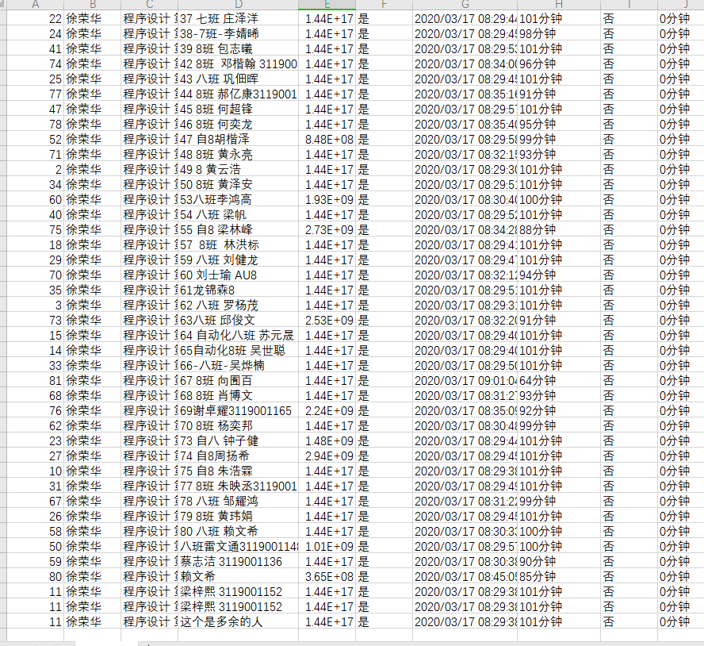
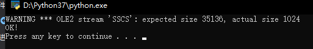
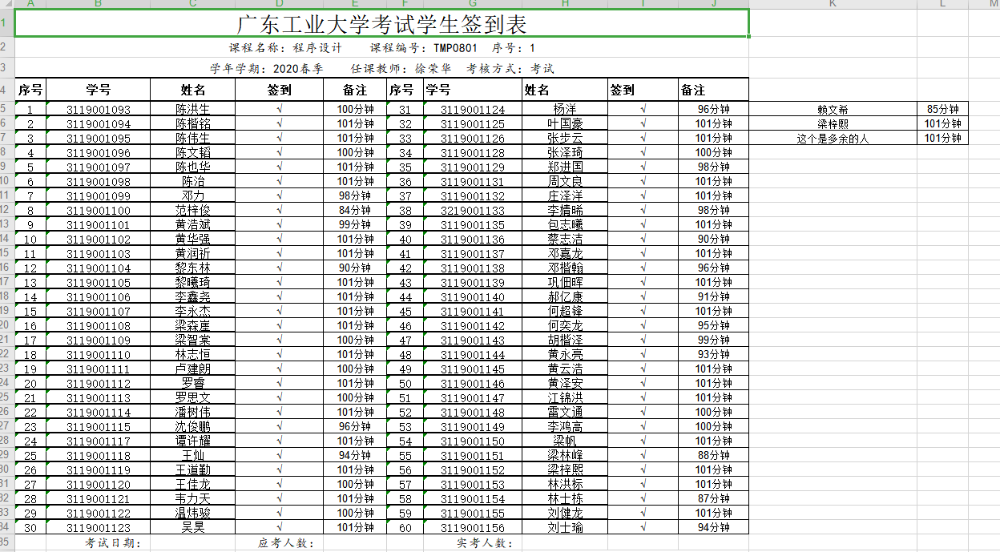

#程序设计大作业

>请填入以下XX部分的内容
关于mark down语法及在线编辑，可参考https://www.mdeditor.com/
github基本用法参考：【腾讯文档】使用步骤
https://docs.qq.com/doc/DR2tFek1YdGpNSG9X

#个人基本信息

  - 班级：2019级自动化8班
  - 姓名：梁梓熙
  - 学号：3119001152
  - 班内序号：56

#大作业题目  
请实现有实际功能的小程序，并完成设计报告。不限开发语言。
设计报告包括但不限于以下内容：  
一、功能设计  
二、框架设计  
三、模块设计及实现  
四、调试及效果  
五、总结  

总结部分反映做大作业过程中踩过的坑，解决方法，体验感想等。  
设计报告以word和pdf两个格式同时提交。  

#测试案例及运行效果

>如何插入图片<https://blog.csdn.net/itmyhome1990/article/details/48765703>

